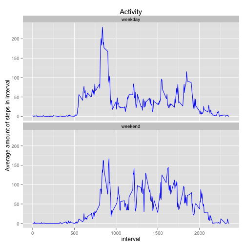

# Reproducible Research: Peer Assessment 1

## Loading and preprocessing the data

Initially we have to download zip-archive with data and read dataset into R.


```r
loadAndUnpackData <- function(archiveUrl) { 
  temp <- tempfile();
  download.file(archiveUrl, temp, method = "curl");
  unzip(temp);
  unlink(temp)
}

if ( !file.exists('activity.csv') ) {
  loadAndUnpackData('https://d396qusza40orc.cloudfront.net/repdata%2Fdata%2Factivity.zip')
}

activityData <- read.csv('activity.csv', header = TRUE, na.strings = 'NA')
```


## What is mean total number of steps taken per day?


```r
aggrData <- aggregate(steps ~ date, data = activityData, sum)

hist(aggrData$steps,
     breaks = 10,
     col = "blue", 
     main = "Activity",
     xlab = "Steps per day")
```

 

```r
meanStepsPerDay <- round(mean(aggrData$steps, na.rm = TRUE), digits = 0)
medianStepsPerDay <- round(median(aggrData$steps, na.rm = TRUE), digits = 0)
```

Mean total number of steps taken per day is 1.0766 &times; 10<sup>4</sup>. 
Median total number of steps taken per day is 1.0765 &times; 10<sup>4</sup>.

## What is the average daily activity pattern?

In order to answer this question we have to calculate mean for each of 5-minute intervals. The plot of mean values for each interval averaged across all dates is shown below.


```r
aggrIntervalData <- aggregate(steps ~ interval, data = activityData, mean)

with(aggrIntervalData, 
     plot(interval, steps, type="l", ylab = "Average amount of steps in interval", xlab = "", col="blue"))
```

 


```r
maxIndex = which(aggrIntervalData$steps == max(aggrIntervalData$steps))
maxInterval = paste(aggrIntervalData$interval[maxIndex], "-", aggrIntervalData$interval[maxIndex]+5); 
```

The interval 835 - 840 contains maximum number of steps on average. 

## Imputing missing values


```r
cc <- complete.cases(activityData)
missingValuesNumber <- length(cc[cc == FALSE])
missingIndexes <- which(!cc)
```

Total number of missing values in the dataset is 2304.

Let's fill missing values in the dataset with mean value of interval which missing value is related to.


```r
activityDataFilled <- activityData

for ( mi in missingIndexes ) {
  interval <- activityData$interval[mi]
  activityDataFilled$steps[mi] <- aggrIntervalData$steps[aggrIntervalData$interval == interval]
}
```


The histogram based on the modified dataset is shown below.


```r
aggrData <- aggregate(steps ~ date, data = activityData, sum)

hist(aggrData$steps,
     breaks = 10,
     col = "blue", 
     main = "Activity (modified)",
     xlab = "Steps per day")
```

 

```r
meanStepsPerDay <- round(mean(aggrData$steps), digits = 0)
medianStepsPerDay <- round(median(aggrData$steps), digits = 0)
```

Mean total number of steps taken per day is 1.0766 &times; 10<sup>4</sup>. 
Median total number of steps taken per day is 1.0765 &times; 10<sup>4</sup>.

In this way we can see that filling missing values did not affect mean value, but slightly affected median value.

## Are there differences in activity patterns between weekdays and weekends?

First, let's define which weekday each observation is related to.


```r
Sys.setlocale("LC_TIME","C")
```

```
## [1] "C"
```

```r
weekdays <- weekdays(as.Date(activityData$date))
```

Then we just append the column containing weekday to dataset and aggregate the number of steps values by two columns - weekday and interval. 


```r
activityDataFilled$weekday <- ifelse(  weekdays == 'Saturday' | weekdays == 'Sunday', 'weekend', 'weekday' );

aggrIntervalWeekdayData <- aggregate(x = activityDataFilled$steps, 
                      by = list(activityDataFilled$weekday, activityDataFilled$interval),  FUN="mean")

colnames(aggrIntervalWeekdayData) <- c("weekday","interval", "steps")
```

The plot below shows how activity pattern on weekdays differs from one on weekends.


```r
library(ggplot2)
g <- ggplot(aggrIntervalWeekdayData, aes(interval, steps)) + 
  geom_line(col="blue") + 
  facet_wrap( ~ weekday, nrow=2) +
  ylab("Average amount of steps in interval") +
  ggtitle("Activity");
print(g)
```

 
